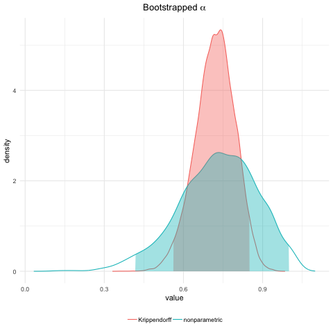
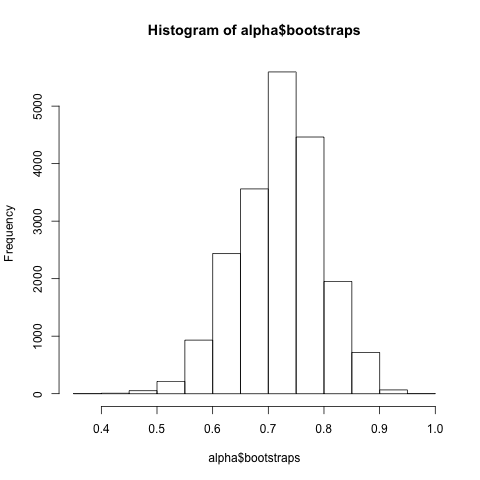
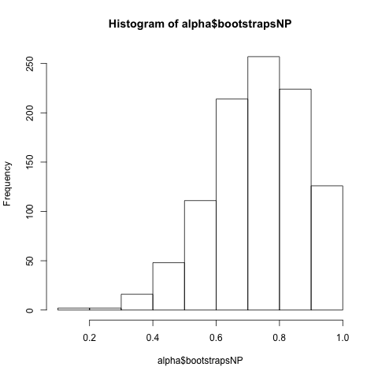

# icr

[_icr_](https://cran.r-project.org/web/packages/icr/index.html) provides functions to compute and plot Krippendorff's inter-coder reliability coefficient $\alpha$ and bootstrapped uncertainty estimates. The bootstrap routines are set up to make use of parallel threads via [OpenMP](https://en.wikipedia.org/wiki/OpenMP).

<!--more-->


## Installation 

```R
# Install the released version from CRAN:
install.packages(icr)

# Or install the development version from GitHub:
# install.packages(devtools)
devtools::install_github(staudtlex/icr)
```


## Enable parallel bootstraps on macOS 

The parallel bootstrap capability of _icr_ depends on compiler support for OpenMP, which the Clang compiler shipped by default with macOS does not support. To circumvent this issue, install the GNU Compiler Collection (GCC), for instance via [Homebrew](https://brew.sh/).

```sh
brew install gcc
```

R needs to know the location of the new compiler. Therefore, modify your _Makevars_ file under ~/.R; if .R does not exist on your system, you may need to create that directory first. Add the following lines to _Makevars_ and save it (note that all future R packages you will install from source and requiring compilation will be built with GCC.).

```sh
CC = /usr/local/bin/gcc-8
CXX = /usr/local/bin/g++-8
CXX11 = /usr/local/bin/g++-8
```

Now, install icr from source.

```R
# From CRAN
install.packages(icr, type = source)

# Latest version from GitHub
devtools::install_github(staudtlex/icr)
```


## Usage 

Load the library and Krippendorff's example data:

```R
library(icr)
data(codings)

codings
```

```text

     [,1] [,2] [,3] [,4] [,5] [,6] [,7] [,8] [,9] [,10] [,11] [,12]
[1,]    1    2    3    3    2    1    4    1    2    NA    NA    NA
[2,]    1    2    3    3    2    2    4    1    2     5    NA    NA
[3,]   NA    3    3    3    2    3    4    2    2     5     1     3
[4,]    1    2    3    3    2    4    4    1    2     5     1    NA
```

Compute the reliability coefficient $\alpha$ for nominal-level data.

```R
krippalpha(codings, metric = nominal)
```

```text

Krippendorff's alpha

Alpha coders units   level
0.743      4    12 nominal

Bootstrapped alpha
Alpha Std. Error 2.5 % 97.5 % Boot. technique Bootstraps
   NA         NA    NA     NA    Krippendorff         NA
   NA         NA    NA     NA   nonparametric         NA

P(alpha > alpha_min):
alpha_min krippendorff nonparametric
     0.90           NA            NA
     0.80           NA            NA
     0.70           NA            NA
     0.67           NA            NA
     0.60           NA            NA
     0.50           NA            NA
```

To check how uncertain $\alpha$ may be, or whether it actually differs from various minimal reliability thresholds, bootstrap $\alpha$. For reproducibility, do not forget to set the seed (defaults to `seed = c(12345, 12345, 12345, 12345, 12345, 12345)`).

Given that bootstrapping may take quite some time for large amounts of reliability data, increase the number of cores across which `krippalpha` may distribute the computations (note that if your version does not support the use of multiple cores, `krippalpha` will reset `cores` to 1).

```R
alpha <- krippalpha(codings, metric = nominal,
                    bootstrap = TRUE, bootnp = TRUE, cores = 2)
print(alpha)
```

```text

Krippendorff's alpha

Alpha coders units   level
0.743      4    12 nominal

Bootstrapped alpha
Alpha Std. Error 2.5 % 97.5 % Boot. technique Bootstraps
 0.72      0.075 0.562   0.85    Krippendorff      20000
 0.73      0.146 0.417   1.00   nonparametric       1000

P(alpha > alpha_min):
alpha_min krippendorff nonparametric
     0.90        0.003         0.126
     0.80        0.137         0.350
     0.70        0.640         0.607
     0.67        0.739         0.683
     0.60        0.940         0.822
     0.50        0.997         0.932
```

Compare the distributions of bootstrapped $\alpha$. The distributions resulting from Krippendorff's algorithm and the non-parametric bootstrap (resampling the coding units) look quite different. For a quick look, just `plot()`.

```R
plot(alpha)
```


Alternatively, use _ggplot2_ to plot the distributions of $\alpha$:

```R
df <- plot(alpha, return_data = TRUE)

library(ggplot2)
ggplot() +
  geom_line(data = df[df$ci_limit == FALSE, ],
            aes(x, y, color = type)) +
  geom_area(data = df[df$ci == TRUE, ],
            aes(x, y, fill = type), alpha = 0.4) +
  theme_minimal() +
  theme(plot.title = element_text(hjust = 0.5)) +
  theme(legend.position = bottom, legend.title = element_blank()) +
  ggtitle(expression(paste(Bootstrapped , alpha))) +
  xlab(value) + ylab(density) +
  guides(fill = FALSE)
```




The vectors of bootstrapped $\alpha$ may also be accessed and plotted directly:

```R
hist(alpha$bootstraps) # Krippendorff-bootstrap
```




```R
hist(alpha$bootstrapsNP) # nonparametric bootstrap
```



